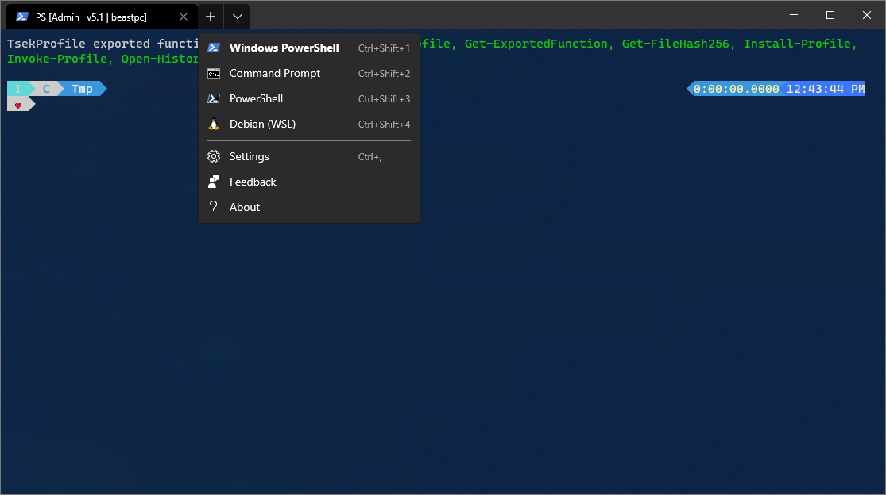

# TsekNet's Terminal

My personal, heavily customized [Windows Terminal profile](https://github.com/microsoft/terminal/blob/master/doc/user-docs/UsingJsonSettings.md).



## Installation

Execute the following command in a PowerShell prompt:

```powershell
iwr 'https://github.com/TsekNet/Windows-Terminal/raw/master/settings.json' -Out "$env:LOCALAPPDATA\Microsoft\Windows Terminal\settings.json"
```

## Requirements

1. Windows 10 1903+
1. Windows Terminal (from Windows store or choco)
1. PowerShell 7 Preview
1. PowerShell 5.1
1. WSL

## What's included

The following Windows Terminal profiles come pre-configured:

1. PowerShell 7 Preview
2. PowerShell 5
3. CMD
4. WSL

## Contributing

Please open a pull request with any issues you run into.

## License

This project is licensed under the MIT License - see the [LICENSE](../LICENSE) file for details.

## Acknowledgments

* Hat tip to anyone whose code was used
* etc
